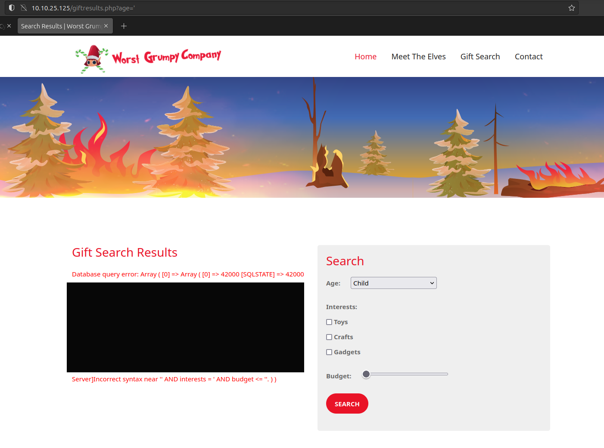
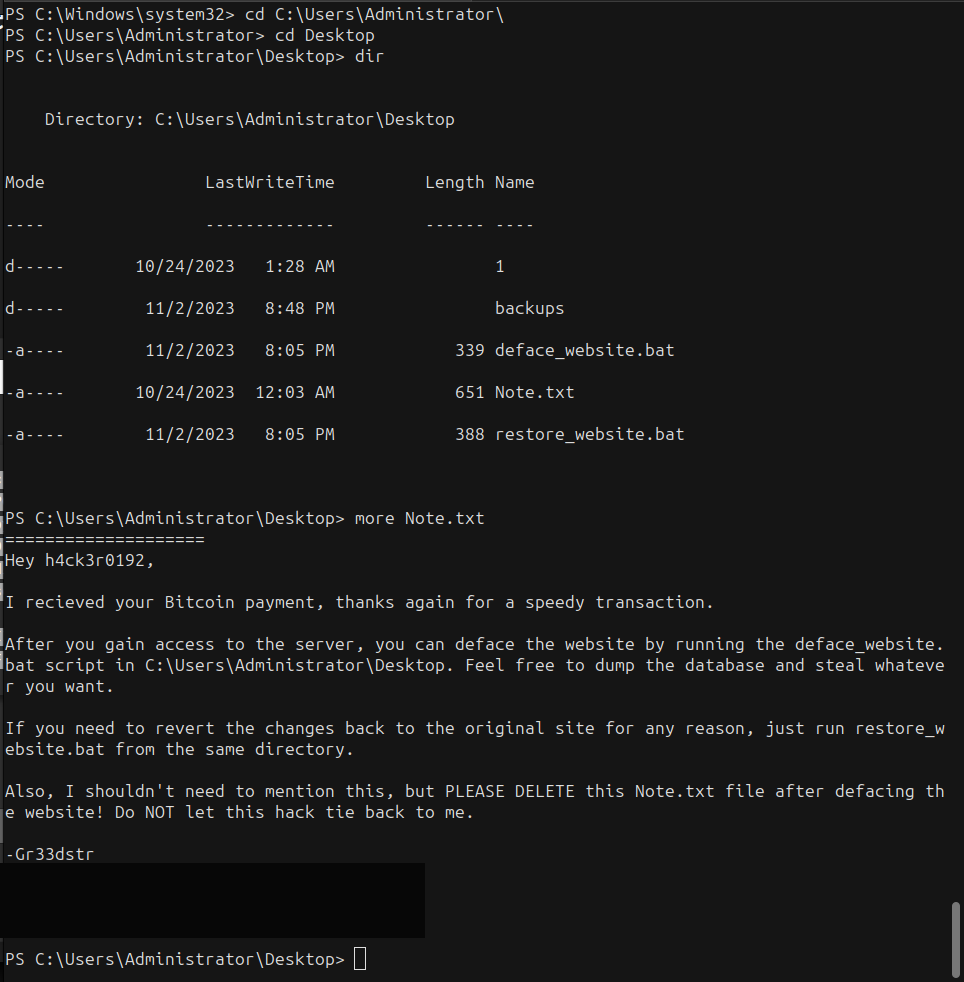

# Inject the Halls with EXEC Queries | Advent of Cyber 2023 | Day 10

## TL;DR of Day 10
SQL Injection vulnerabilities are one of the most notorious in the wild as they can be used produce dangerous results. Tools like SQLMap can help us identify(exploit!) these vulnerabilities.


## walkthrough

Start the machine and wait for 3-5 minutes and then visit the IP address in the browser. You should see the website which looks already hacked one.

### Q1: Manually navigate the defaced website to find the vulnerable search form. What is the first webpage you come across that contains the gift-finding feature?

Scroll through the home page of the website. You should find the `Start My Gift Search` button. Clicking on it will take you to the page with filter form. Check the endpoint of the website. That should be your answer.

### Q2: Analyze the SQL error message that is returned. What ODBC Driver is being used in the back end of the website?

On the gift search page, directly search with the default parameters. You will see that it is passing the search parameters as the query parameters. Now since we already know that something related to the sql injection vulnerability is there, let's try to confirm it. use the `?age='` parameter to see the result. You should see error log which mentions the used drivers as you can see in the screenshot below.




### Q3: Inject the 1=1 condition into the Gift Search form. What is the last result returned in the database?

Now let's try to get all the search result using the OG sqli syntax. Let's use `?age=' OR 1=1 --` to retrive all the search results. You should have all the results and you will have your flag at the end of the search results.


### Q4: What flag is in the note file Gr33dstr left behind on the system?

> Note: I will take different and lazy approach to solve the remaining tasks from the official writeup. Follow that writeup first and then use this method as this is kind of shortcut method.

Okay, let's use the sqlmap now. You can install it from the apt source with `apt install sqlmap`. We already know that we are dealing with the Microsoft SQL Server database. We can construct the sqlmap command as following to obtain the command execution:
```bash
sqlmap -u "http://IP/giftresults.php?age=child" -D 'Microsoft SQL Server' --os-shell
```
You will need to answer some yes/no question to navigate through it and you should have the shell the prompt at the end as shown in the image.

It is not very stable shell so let's try and get one. First run the `nc -lnvp 9001` where we will receive the reverse shell. Now visit the revshells.com and add your IP and 9001 as the port and select the powershell #2 and shell as the cmd. Copy it and paste it into the sqlmap shell. We should receive the reverse shell on our netcat listener.

Now we have powershell. Let's go to the C:\Users\Administrator\ to check if something is there. Nothinng unusual there. Let's check the Desktop folder. Ahhah, we found the note. Which included the message from previous hacker and the flag.



### Q5: What is the flag you receive on the homepage after restoring the website?

As the note from last questio we need to run the restore_website.bat to restore the website. Run it as ./restore_website.bat. You should be able to see the flag on the homepage of the website.

>Note: if you can't access the website after reverse shell then close the reverse shell and sqlmap connections. We won't need them anymore.


That should be all for today. Personally SQLi is one of my favourite vulnerabilities(weirdo!) so I really like this basic type of rooms that allows people to understand the basic concept. Will see you tomorrow with something new and interesting, till then keep hacking!