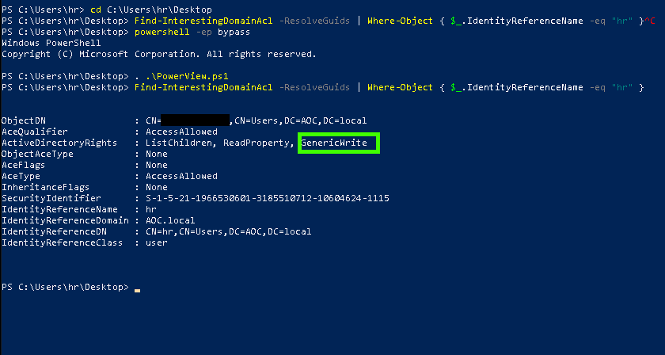
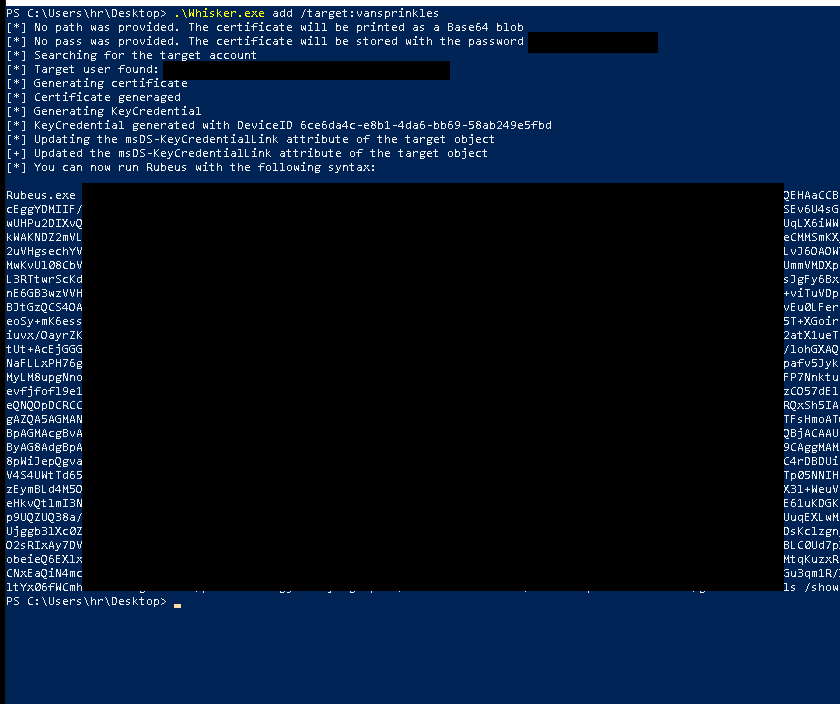
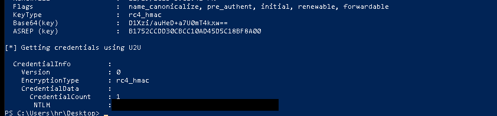

# Jingle Bells, Shadow Spells | Advent of Cyber 2023 | Day 11

## TL;DR of Day 11

We are going to learn about the Active Directory today, in a nutshell, it is domain which holds usernames,passwords and groups of users for windows. It is used for bussiness mostly. But as a general rule, it also has its own limitations and exploitation. Let's explore one of them.


## walkthrough

Start the machine and access it using the split screen or RDP.

### Q1: What is the hash of the vulnerable user?

Start the powershell and cd into the Desktop folder. Then we need to enable scripting in the powershell with `powershell -ep bypass`. Run the script `PowerView.ps1` to load all the required functions.

All three commands should look something like this:
```ps
cd C:\Users\hr\Desktop
powershell -ep bypass
. .\PowerView.ps1
```

Now run the `Find-InterestingDomainAcl -ResolveGuids` to check the users list and their rights to the system. This will list for all users, we need only for our current user which is `hr`. We can do that with the command `Find-InterestingDomainAcl -ResolveGuids | Where-Object { $_.IdentityReferenceName -eq "hr" }`. Look at the ActiveDirectoryRights row. It includes GenericWrite access which basically allows us to exploit the certifaction system.


Before we go any further, look closly at the ObjectDN row and make sure to note the first username. We will call it USERNAME from onwards here. 



Now we can use `Whisker` and `Rubeus` to further exploit this. These are utilities that are provided in the machine itself and you can learn more about them in the description of the day.

Let's first get the certificate using Whisker. Don't forget to change the USERNAME to the actual username.

```ps
.\Whisker.exe add /target:USERNAME
```

You should have output as per below.



Copy the Rubeus code prompted at the end and add .\ before it to execute the same. You should get the NTLM hash at the end of the output. I am adding screenshot of the end of the output.



That hash is the answer of our first question.


### Q2: What is the content of flag.txt on the Administrator Desktop?

Now since we have the NTLM hash, we can loging using evil-winrm. If you are using kali or attackbox, it is already installed. If you are setting up your own system then it is very tricky to set it up. Rather easy solution is to use docker image for this. I used following command to gain shell with username and NTLM hash using evil-winrm. Don't forget to add values for the IP, USERNAME and NTLMHASH.

```cmd
docker run --rm -ti --name evil-winrm  oscarakaelvis/evil-winrm -i IP -u USERNAME -H NTLMHASH
```

That should give you the powershell prompt. Now go to the `C:\Users\Administrator\Desktop` and check the files there. You should have your flag there.


That should be it for the day. I will see you tommorow with some new information to be learned.