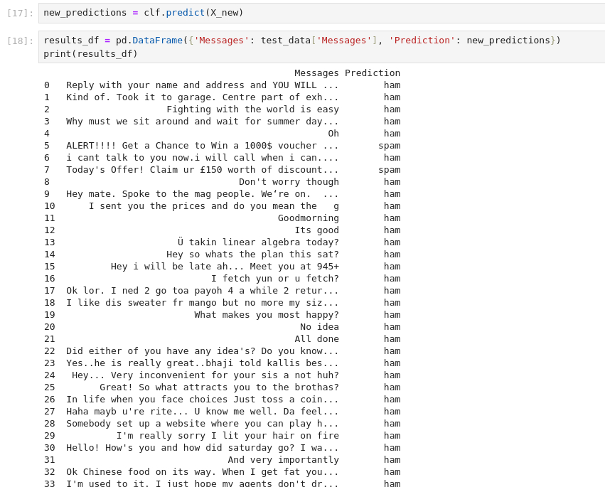

# Jingle Bell SPAM: Machine Learning Saves the Day! | Advent of Cyber 2023 | Day 15

## TL;DR of Day 15
We will continue the journey of the machine learning from tommorow. We will be creating a classifier model for the spam or non-spam emails. We will go in depth for the process of creating a classifier model. 

## walkthrough
Start the machine and wait for 3-5 minutes for it to boot up. Then access the machine from the split view. You should see the browser with jupyter notebook. We will work on this notebook for this task.

### Q1: What is the key first step in the Machine Learning pipeline?

We will need to collect the data before we can perform anything.

### Q2: Which data preprocessing feature is used to create new features or modify existing ones to improve model performance?

We need to use our engineering brains for this feature.

### Q3: During the data splitting step, 20% of the dataset was split for testing. What is the percentage weightage avg of precision of spam detection?
This will require us running the code. let's look at the notebook and understand the code as per the discussion. Run total 11 cells of code. `Model Evaluation` should be the last section of code you run. You will see the weightage avergae of precision of spam detection in the output. If your answer does not get accepted, try checking the expected output from the room description. This happens due to the randomeness of the model training.

### Q4: How many of the test emails are marked as spam?
Now look at the cell no. 13. It has blanks in the ps.read_csv method. We need to add the file name of the test dataset `test_email.csv` there. Once you add it, run all the cells to get the final result. You would see that we will have several detections of the emails as per below screenshot.



We need to calculate the total numbers of spam. We can easily do this with filtering of pandas dataframe. We can use below code to get the total number of spam messages.

```python
print(results_df[results_df['Prediction'] == "spam"].Messages.count())
```

You can create a new code block at the end and add this code there and run the cell.
### Q5: One of the emails that is detected as spam contains a secret code. What is the code?

We need all the messages with the spam, let's use the cell from previous question and update it with the below code:

```python
print(results_df[results_df['Prediction'] == "spam"].Messages.count())
for i in results_df[results_df['Prediction'] == "spam"].Messages:
    print(i)
```

You should see all the messages that are spam. You will see that one of them contains a secret code which will be the answer of the question.


That should be all for the day. See you guys at tommorow for something new.