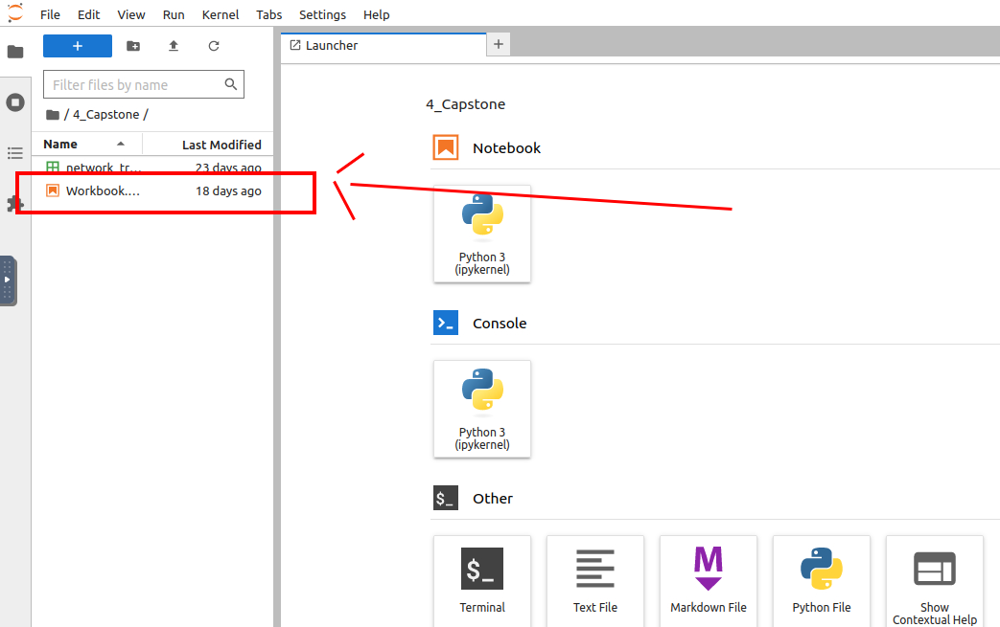
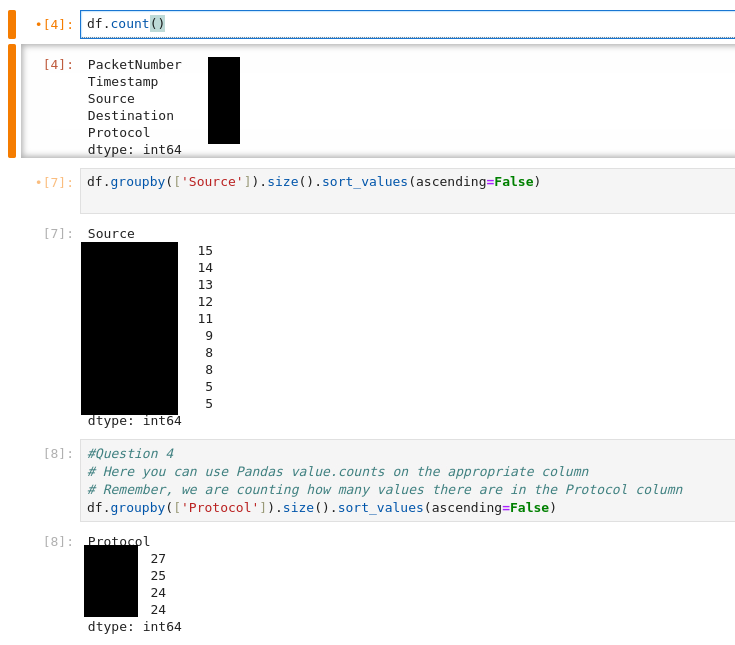

# O Data, All Ye Faithful | Advent of Cyber 2023 | Day 2

## TL;DR of Day 2

Every good system needs to have a good logging. Logging can be very useful for debugging and forensics. But sometimes logging creates a huge amount of data to be parsed. We need some tools in order to visualize this data.

Python is great language for data related tasks and combining it with libraries like pandas and matplotlib can create great tool for logging visualization. In this task, we will learn how to use python for data visualization with pandas and matplotlib in jupyter notebook.

## Walkthrough

Start the Day 2 machine and wait for 1-2 minutes to get it configured. Then use the `show split view` button to access the machine. You can find that beside the title of the room on top.

You should see the browser with jupyter server running. If you don't see the browser then open the Firefox and go to `127.0.0.1:8888/lab` to access it.

> Note: I won't be explaining everything about python and jupyter server here, You can read that on the day's description. Simply because I won't be able to explain it better than them.

### Q1: How many packets were captured (looking at the PacketNumber)?

Before we jump into answering questions we need to set up some things. First double-click on the Workbook.ipynb to open the notebook.


Now you should see the preloaded IPython notebook. You first need to run the cell 1 and cell 2. Cell 2 should output the first five rows of the csv file we need to analyze.

Now go to cell 3 where we will use it to answer our question.

We can use the following code to count the number of rows for each column.
```python
df.count()
```
> Note: I will add screenshot with all commands at the end.

### Q2: What IP address sent the most amount of traffic during the packet capture?

Now, go to cell 4. There is already explanation about the code and code itself. Although it is kind of enough information for this example, but what if we have a lot of data? Then we need to have sorted data, right? So we are going to sort the data with the values with following code.

```python
df.groupby(['Source']).size().sort_values(ascending=False)
```

This should allow you to see the most frequent data on the top.

### Q3: What was the most frequent protocol?

This is the same as the last question, we just need to change the column to `Protocol`.

```python
df.groupby(['Protocol']).size().sort_values(ascending=False)
```




And that should do it. This was all for Day 2 of the great adventure ahead. See you tomorrow with the new and more exciting adventures and learnings.