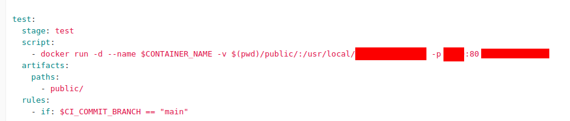
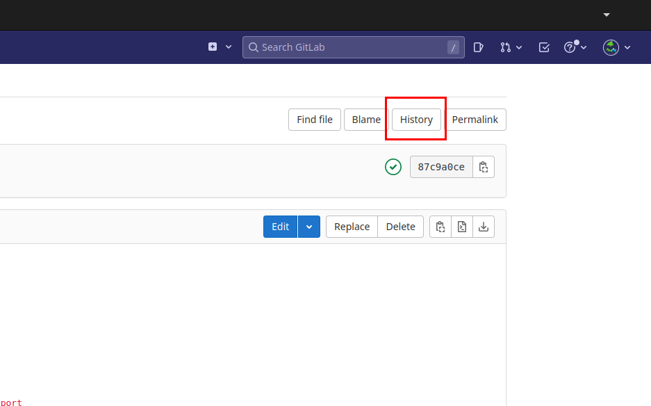
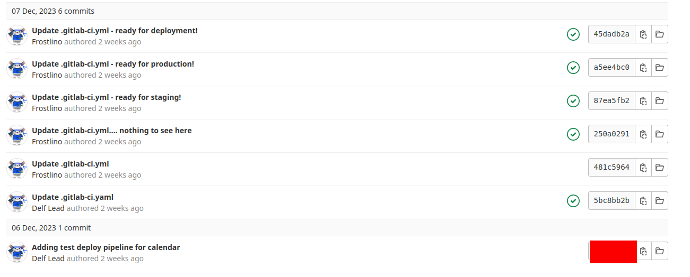

# Advent of Frostlings | Advent of Cyber 2023 | Day 20

## TL;DR of Day 20

We will be learning about the CI/CD permissions and restrictions today. We will be using the gitlab CI/CD for this and we will fix the CI/CD permissions and configuration along the way.

## walkthrough

Start the machine and wait for 4-5 minutes to get it running. Then visit the IP in the browser and you will see the gitlab login page. If you see gitlab 500 error page then wait for couple of minutes and then try again. Login with the credentials `DelfSecOps:TryHackMe!`. You will have the access to the one repository.

### Q1: What is the handle of the developer responsible for the merge changes?

Open the repository and open merge requests from the left panel. You will see that no merge requests are open but one merge request is laready merged. Open the merge request and check the @ handle of the user who made the commits. Remember that username is different, click on the username to open the profile and you will have the @ handle of the user there.

### Q2: What port is the defaced calendar site server running on?

Now open the Repository -> File from the left panel and we will see three things in the root of the project. Public folder, .gilab-ci.yml file and README file. Open the .gitlab-ci.yml file.

Now check the script section of the test pipeline and we will see that there is one port is mapped in docker container's port 80. That should be our port. We can verify this by visiting the address.

### Q3: What server is the malicious server running on?

From the same docker command from above, note the image that it is running at the last. Search for the image on the docker hub and you should see the name of the server in the readme file. Also you can guess the server based on the volume mounting of the command.

### Q4: What message did the Frostlings leave on the defaced site?

Now let's visit the site on the port we discovered port. We will see the defaced image with the message inside it. That is our answer.

### Q5: What is the commit ID of the original code for the Advent Calendar site?

Now let's try to revert the commits of the malicious code. Open the .gitlab-ci.yml file and click on the history button on the top right corner. This will list all the commits of the file. 

Check the first commit of the file which should contain the original code for the file. Check the commit code on the right side and that will be answer to our question.

That's it for the today. It was great learning about the CI/CD and how unauthorized access to it can harm a production site. I will see you tomorrow with some new topic. Until then have fun.