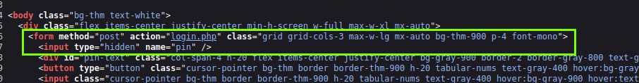

# Hydra is Coming to Town | Advent of Cyber 2023 | Day 3

## TL;DR of Day 3

We use password in our day to day life on almost any site we visit. If you ever thought that why websites asks us to create strong passwords using different combinations of characters and number? Here is great example. If we use uppercase, lowercase and digits for password and we create 8 characters long then it has around 218 Trillion combinations. but we just increase it to 10 characters then it becomes 839 quantillion(839299370000000000) yup that many zeros.

As for hacker(cyber security researcher) you can use several tools to brute force your way using tools like crunch and hydra. Spoiler alreats: No real life systems allows brute forcing. As said earlier, we have combinations in trillions and so forth but most modern systems restricts you after serveral tries, mostly three times.
But that does not mean it is not something you shouldn't know about. Sometimes you can get your hands on systems that has no such protections.

## Walkthrough

Start the machine and wait for some time to get it running then visit the http://IP:8000 to access the website. You will see the website with the pin interface with 0 to 9 and A to F. So we have 16 possible characters.

Now if you type any random combinations then first thing you will notice is that it is only three characters long. So basically we will have 16^3 = 4096 combinations. 
> For math behind it, possible combinations = (available charaters count)^(password length)

Now I always like to go through the code of the website to see if anything can be revealed from there. Press ctrl+U to open the source code. You will see most basic PHP form submission for our PIN input with post request to `login.php`.



We get three important information from there, 
1. method=post => we have post form request
1. action=login.php => we are sending request to login.php
1. <input ... name=pin /> => we are sending our 'password' as pin parameter

Now let's get our shop setup. We will use crunch and hydra.

- Crunch: It will create all possible combinations for our PIN.
- Hydra: It will do the automatic brute forcing job for us.

First let's create combinations. We can use following command:
```bash
crunch 3 3 0123456789ABCDEF -o 3digits.txt
```
Basic format explanation is as per following:

`crunch [min-length] [max-length] [possible-characters] -o [filename]`

Now we will have 3digits.txt file in our current directory. It will have 4096 combinations.

We can use the hydra now with that file to brute force. You can use the following command

```bash
hydra -l '' -P 3digits.txt -f -v 10.10.104.159 http-post-form "/login.php:pin=^PASS^:Access denied" -s 8000
```
Don't forget to change the IP to your machine.

Well for hydra, there is lot to learn, I am not gonna explain the command as it is already explained in the room's day description. And I will suggest going through [hydra](https://tryhackme.com/room/hydra) room.

Let it run for some time and you will have the password. Use it to login on the website and you will have some simple thermostat website. Just click on `unlock door` and you will have your flag.

> I did not click anything on first try, I went into source code and found the flag there.

And that should do it. This was all for Day 3 of the great adventure ahead. See you tomorrow with the new and more exciting adventures and learnings.