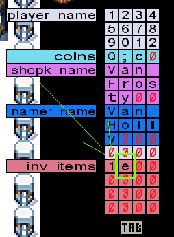

# Memories of Christmas Past | Advent of Cyber 2023 | Day 6

## TL;DR of Day 6
We will learn buffer overflow in today. In simple terms buffer overflow is technique to acccess the memory that is not allocated to certain variable. Meaning that you can manupulate the memory block as per your will to gain access to something that you don't have. Sounds a bit strange but it is actually quite easy once you underastand it.

## walkthrough

Start the machine and wait for the IP to show up. Then open the site `https://10-10-127-95.p.thmlabs.com` that should be something like this but with your IP address.
You can find this link in the description of the day. You should be greeted with the game.

Let's understand the game first. So you interact using spacebar. You can interact with computer to get 1 coin. You can go to green guy to change your name which costs 1 coin. Then you can go to blue guy to buy decorations. You can see the inventory on the left side. And finally you can interact with christmas tree to complete the game. Lastly with tab you can see memory blocks on the right, once and you will see ASCII representation and one more time pressing tab will show hexadecimal formatting. Let's begin.

Now as mentioned in the description, if you obtain 13 coins and change the name to `scoogerocks!` you will get the 33 coins. If you do this while keeping the memory blocks open in ASCII mode then you will see that the coins section of the memory block got changed. Why? We changed the name and it changed the coins block? Yup, exactly.

This is what buffer overflow is. Most of the languages don't actually check the varibale's memory length and will allow to write to next memory block. That is exactly what is happening here. After 12 blocks/bytes of the name next 4 characters are wriiten to coins variables memory. So basically we can have any 12 characters in the name and adding anything after that will allow us to set the coins. Let's get so much money and buy everything. You can use something like `123456789012abc` now you will have 6513249 coins. And star is only for 10000 coins, let's buy the star.

Go to blue guy and try to buy the star, he will decline saying that game is rigged to not let anyone actually buy the star. huh? that was not so good from them hah!

Now what? Remember that everything has it's memory and anything can be changed as we have access to all memory block indirectly. When you tried to buy the star you must have seen that you get something in your inventory instead of the star, and at the same time one entry gets added to the inv_items memory block. As per shown in below image:

Now if you remember then code for star to be bought was `d` so basically we need to insert `d` into the `inv_items`(That sounded little different). jokes aside, if you actually count from the start then you will see that inv_items start at 45th block. So we can rename ourself to something that is 44 characters long and then add d after it like `12345678901234567890123456789012345678901234d`. And with the magic of buffer overflow we have star in the inventory. Now go to the christmas tree and interact it with the spacebar and enjoy the flag.

As far as the first question is concerned then I will let you handle it but you can always rename yourself as `somethinglikCOOL` to get the answer.

That was it for the day, it was great learning a new way to exploit things in the wild. See you tommorow with the new and exciting journey.