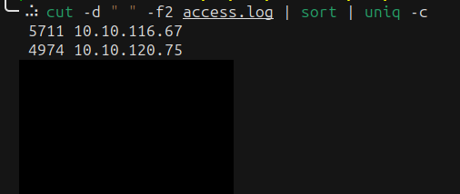
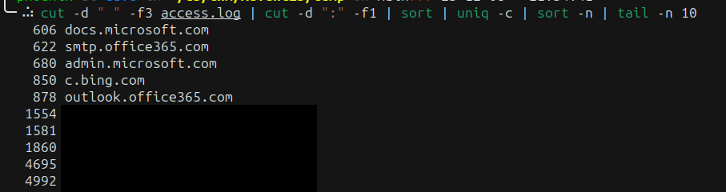

# ‘Tis the season for log chopping! | Advent of Cyber 2023 | Day 7

## TL;DR of Day 7

We will be SOC analyst today. First thing you do when something goes wrong is check logs. But sometimes not all logs are easy to navigate and understand. We need some knowledge of the tools that can help us in this. Having knowledge of the linux commands like cut, sort, uniq, grep etc can help us so much in analyzing logs. 


## walkthrough

Start the machine and access the split screen. You should see artifacts folder on the desktop. Open command line and cd into that directory at ~/Download/artifacts. Now if you check the directories content then you will see one log file named `access.log`.

As per the description from the day, we are working with the log file for the proxy server. The log formatting is as per below


|date and time|IP|Domain:Port|Method|Path|Status Code |Content-Length|User-Agent|
|---|---|---|---|---|---|---|---|
|[2023/10/25:15:46:30]|10.10.46.50|cacerts.digicert.com:443|GET|/|200|913|"Mozilla/5.0 (Windows NT 10.0; Win64; x64) AppleWebKit/537.36 (KHTML, like Gecko) Chrome/118.0.0.0 Safari/537.36"|

Now let's start answering questions.

### Q1: How many unique IP addresses are connected to the proxy server?

First thing first we need to list all the IPs.
We can do this using cut command and using the space(" ") as the delimeter as per following command:
```bash
cut -d " " -f2 access.log
```

This will print all the IP addresses, we want only unique ones, we can combine the sort and uniq command to achieve this, let pipe both of this command to our previous command:
```bash
cut -d " " -f2 access.log | sort | uniq -c
```

You should see something similar to the screenshot below:



> Note: Your terminal will look different as I downloaded access.log into my local machine for ease of access.

We can count the number of entries here manually but we can also pipe the wc command to do it automatically like below

```bash
cut -d " " -f2 access.log | sort | uniq -c | wc -l
```

This is the answer of the first question.


### Q2: How many unique domains were accessed by all workstations?

Looks same as last time, let's update the field from 2 to 3 and something like below:

```bash
cut -d " " -f3 access.log | sort | uniq -c | wc -l
```

You should have got the 118, which if you enter in the answer, it will reject it as it is not correct answer. If you look correctly, we have domain and port in the same column. So we need to remove the port from the domain before listing unique values for domain.

We can do that by using cut with ":" delimiter and extracting the first field like `cut -d ":" -f1`. Our final command should look something like below:

```bash
cut -d " " -f3 access.log | cut -d ":" -f1 | sort | uniq -c | wc -l
```

That should be the right answer to the question.

### Q3: Based on the high count of connection attempts, what is the name of the suspicious domain?

Based on the `high count` of connection attempts. So we need to check the domains that have highest number of connections.

Let's remove the wc -l from the last command, append the sort instead with `-n` option to consider numbers. Now we only want the highest connection so we can check last 10 entries with the tail command. And our final command should look something like below:

```bash
cut -d " " -f3 access.log | cut -d ":" -f1 | sort | uniq -c | sort -n | tail -n 10
```

Our output should have last lines with the highest number of connections as per the screenshot:



Now you need to focus on the last five domains(hidden in the screenshot) and check them. One of them will be suspisious and that is our answer.


### Q4: What is the source IP of the workstation that accessed the malicious domain?

Now let's export that domain as the DOMAIN variable for ease from now on with `export DOMAIN=<that_malicious_domain>`

Now in order to check the IP that tried to connect to the domain, we can search that domain with grep command directly, something like,

```bash
grep $DOMAIN access.log
```

You should be easily see the IP and that is our answer.


### Q5: How many requests were made on the malicious domain in total?

We can just count the lines from the last command with `wc -l`, something like,

```bash
grep $DOMAIN access.log | wc -l
```

That would be our answer.

### Q6: Having retrieved the exfiltrated data, what is the hidden flag?

Okay, let's look at the exfiltrated data. Let's one of the log line

`[2023/10/25:16:04:32] REDACTED REDACTED:80 GET /storage.php?goodies=bGFuZSBNb2RlbCBLaXQK 200 362 "Go-http-client/1.1"`

We can see something being passed as query param goodies, let's first check that. If you are much experianced then this might take some time, but it common practice to encode values with base64 in query params and this looks like it, let's check that using base64 -d like below

```bash
echo "bGFuZSBNb2RlbCBLaXQK" | base64 -d
```

That does look like valid text, now let's extract all the params value. Path is at fifth field in the log so extract it first with `cut -d " " -f5` after the grep command. Something like 
```bash
grep $DOMAIN access.log | cut -d " " -f5
```

Which should print all the lines with URL path like `/storage.php?goodies=bGFuZSBNb2RlbCBLaXQK`. Now let's cut it with `=` and get everything after it, basically second field. We can use `cut -d "=" -f2` for this after the above command. And pass this output to `base64 -d` command to get the final result. Our command should look something like below:

```bash
grep $DOMAIN access.log | cut -d " " -f5 | cut -d "=" -f2 | base64 -d
```

Now this looks like password hashes with username and some description. You probably won't find flag in this whole data directly. We know the standard format of flags include curly brackets(`{}`) so we can seacrh them in the output to get the flag. Our final command should look something like below:

```bash
grep $DOMAIN access.log | cut -d " " -f5 | cut -d "=" -f2 | base64 -d | grep "{"
```

And there you have it, final answer of the day.


And that should do the day. It was fun to learn the log analysis. If you want to know or learn more about the log analysis then there are tools for this such as splunk, datadog etc. 

See you tommorow with something new and till then have fun and keep learning.