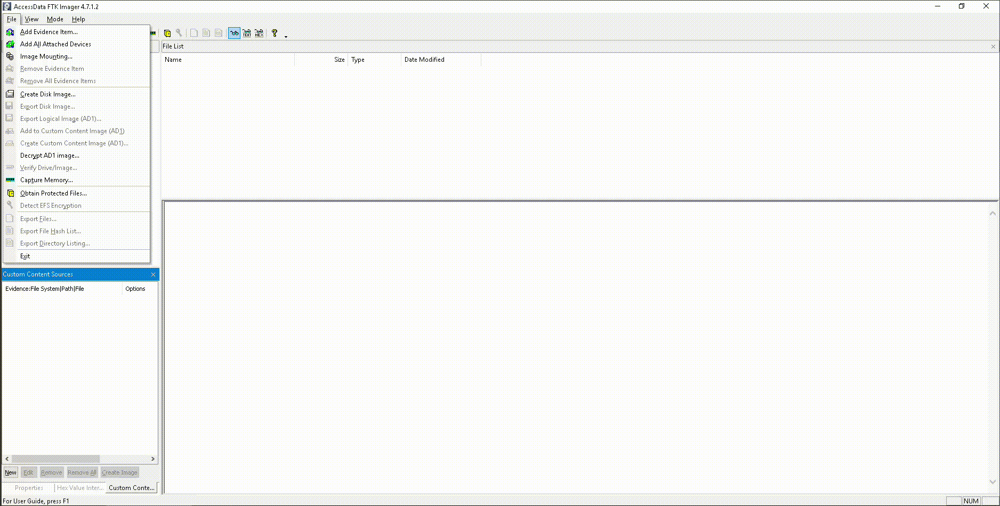
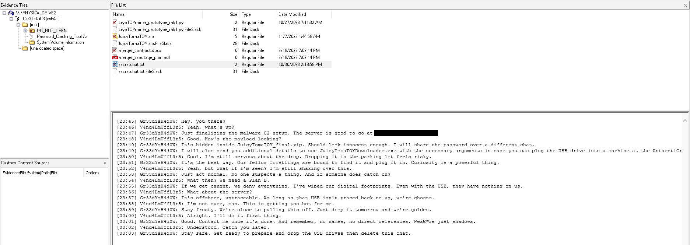
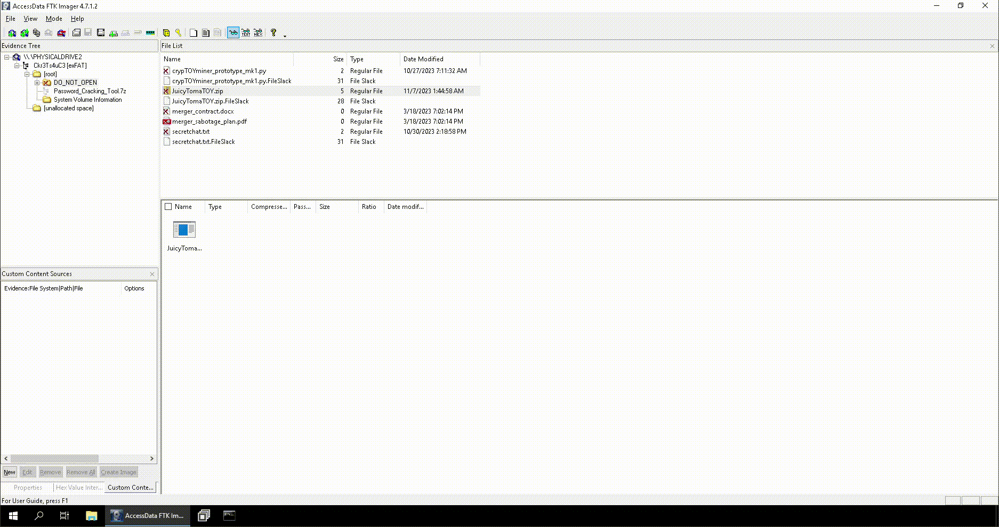

# Have a Holly, Jolly Byte! | Advent of Cyber 2023 | Day 8

## TL;DR of Day 8

We are becoming the cyber police today. Finding out what happened during a cyber attack is as important as defending against them. We can use so many forensics tools available to us. We are going to learn about the FTK manager today. It is used to examine the drives and it's contents. It can be used to recover deleted files and their contents.

## walkthrough

Start the machine and access it using split view after 2-3 minutes. You should see the windows machine. We have FTK manager on the desktop, go ahead and open it. It might take some time to open. Now we need to add our drive which we want to analyze. It can be done from File -> Add Evidence Item -> select "Physical Drive" -> Select "\\PHYSICALDRIVE2 - Microsoft Virtual Disk [1GB SCSI]"

### Q1: What is the malware C2 server?

Where would be such information? Let's check the folder contents first. If you open the drive then you will see there is a folder named \[root], open it. You should see another folder named `DO_NOT_OPEN`. Don't mind me if I do. Open that folder. You will see lot of deleted files lying around. One of them is secretchat.txt. Open that file in automatic mode and you will see converation between two people. 

we have name of the server and answer to the question.

### Q2: What is the file inside the deleted zip archive?

There is a zip file in the same folder which was also deleted. Let's restore it and see the filename inside it.

You can recover file by right clicking and then select `Export File` and select the location to the file. You can check in below gif:

Now open the zip file and you should see one file inside it. That is our answer to the question.

### Q3: What flag is hidden in one of the deleted PNG files?

There are no .png files in the DO_NOT_OPEN folder. Now go back to \[root] folder. You should see the two .png files named `portrait.png` and `wallpaper.png`. Now all you have to do it open both file in `hex` mode and then search for the `THM{` in there. You should be able to find it easily.

### Q4: What is the SHA1 hash of the physical drive and forensic image?

Select the drive from `Evidence tree`(left panel) then go to File -> Verify Drive/Image and let it run. It should generate the required hash. Grab the sha1 from the output and that should mark the end of the day for us.

That was all for today, see you tommorow with some other exciting learnings.