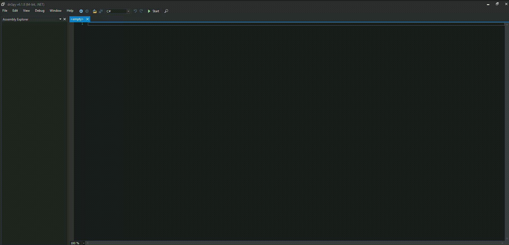
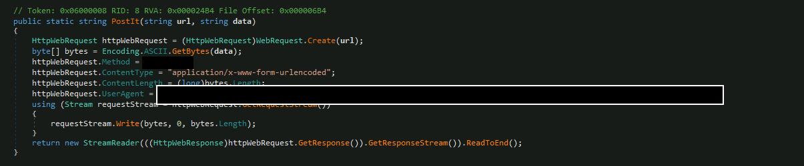
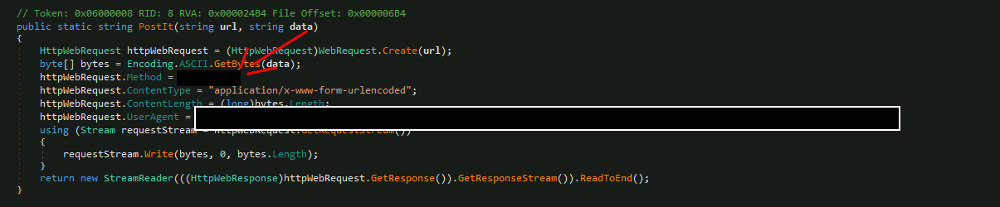
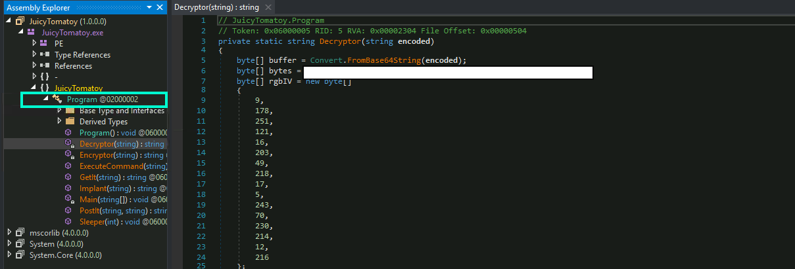

# She sells C# shells by the C2shore | Advent of Cyber 2023 | Day 9

## TL;DR of Day 9

Today we are going to learn how to reverse the malware. Most of the languages like C, C++ are compiled to machined code for execution which makes them hard to be reverse engineered. But there are languages like C# which compiles it to intemediate code which makes them easier to decompile and reverse engineer. We will reverse engineer one the malware from yesterday using the tool called dnSpy which allows us the decompile and debug the C# code easily.

## walkthrough

> Note: working with malware is very tricky thing. Never trust the malware code to the slightest. Always use the controlled environment.

Start the machine and access it using the split screen after 2-3 minutes. You should see the dnSpy on the desktop. Open it and load the malware code using `File -> Open -> Select file type as all files -> Select the file from Desktop/atrefacts/JuicyTomaTOY_defanged`. You can follow as per below:

### Q1: What HTTP User-Agent was used by the malware for its connection requests to the C2 server?

You should see the Entry Point: JuicyTomatoy.Program.Main on the line no. 4. Click on the Main to open the Main method. We see the code of the C2 server. First imoprtant thing you will see is that it is making post requests to something on line no. 22. If you double click on the PostIt method to look inside it. You will see the User-Agent used for connection. That will be the answer.

### Q2: What is the HTTP method used to submit the command execution output?

Now scroll back to the top to go to Main method again. If you look and understand the code you will see the line no. 54 to 56 is executing and sending the command. It is the same method as earlier. You can check the HTTP Method and that would be the answer.

### Q3: What key is used by the malware to encrypt or decrypt the C2 data?

If you open the Program folder from the left panel and you will see Encryptor and Decryptor method. Open the Decryptor method and you should see the key there stored as the varibale.

### Q4: What is the first HTTP URL used by the malware?

Go back to main method again. Let's see when the first request is being made in the code execution. Well to our surprise we keep coming back to line no. 9. It is using the value from url variable which is string concatanation of str and other hardcoded string. Combine them and you have your answer.

### Q5: How many seconds is the hardcoded value used by the sleep function?

Okay in the Main method we see the Program.Sleeper method being called on line no. 14. It is using the count variable which is being set on the line no. 10. It is defined in the milliseconds so convert it to the seconds and you have your answer.

### Q6: What is the C2 command the attacker uses to execute commands via cmd.exe?

From line no. 30 to 36 we see there are four commands: sleep, shell, implant and quit. Out of which one is pretty self implying. It is common name but understand the code if you want the real answer. 

### Q7: What is the domain used by the malware to download another binary?

The answer is inside the main function itself. You can look at the code and check what other domains are being called. I won't answer it here. This ones on you.

>Note: I have left some answers to yourself here, because malware defuscation is something you should do by yourself. A pin point guide won't help you any better. You need to gain abaility to read and understand the code.

Okay, See you tommorow for the new adventures of the knowledge.